# 소반 (Soban)

> 내 모습으로 만든 페르소나를 허공에 띄우고, 한국식 좌식 두레반에 둘러앉아 이야기하는 Apple Vision Pro 앱.


**소반**은 작은 좌식 상을 뜻합니다. 이 앱은 사진 한 장으로 투명 배경의 2.5D 페르소나를 만들고, Vision Pro 의 머리 자세·손 위치·목소리로 그 페르소나를 살아 움직이게 한 뒤, 같은 Wi‑Fi 의 Vision Pro 들과 두레반 여섯 자리에 둘러앉게 합니다. 모든 처리는 기기 안에서 끝나고 서버는 없습니다.

## 데모 영상

| [](https://youtu.be/YkVojNS1Je8) | [](https://youtu.be/M_rHSixSkKw) | [](https://youtu.be/BjRCnjIqMcg) |
|---|---|---|
| [Demo 1 — 좌식테이블에 둘러앉아 소통](https://youtu.be/YkVojNS1Je8) | [Demo 2](https://youtu.be/M_rHSixSkKw) | [Demo 3](https://youtu.be/BjRCnjIqMcg) |

Apple Vision Pro 실기기에서 녹화한 영상입니다. 썸네일을 누르면 YouTube 로 이동합니다.

## 기능

- **페르소나 스튜디오** — 사진 보관함에서 고른 사진을 Vision 으로 인물만 분리하고 눈·입·코 랜드마크를 찾아 "종이 인형" 카드를 만듭니다. 이름, 입 벌림 강도, 카드 높이를 다듬고 마이크로 바로 움직여 볼 수 있습니다.
- **살아 움직이는 페르소나** — 머리 yaw/pitch/roll 과 이동, 손목 위치(반투명 손), 목소리 크기에 따른 입 벌림, 주기적 눈 깜빡임, 호흡, 말할 때 밝아지는 바닥 글로우, 이름표와 반응 말풍선.
- **두레반 공간** — 혼합(mixed) 이머시브 공간에 옻칠 원탁, 방석 6개, 찻잔, 다관, 다과를 놓습니다. 나는 항상 가까운 자리, 다른 사람들은 반시계 방향으로 앉습니다.
- **모임** — 모임 열기/참여(로컬 네트워크 P2P), 호스트가 좌석표를 관리, 페르소나 교환, 15Hz 포즈, 60ms 음성 청크를 좌석 위치에서 공간 재생, 반응 이모지(👋 👍 ❤️ 😂 🍵 👏).
- **데모 손님 (블렌더 USDZ 흉상)** — 혼자서도 상이 북적이도록 번갈아 이야기하고 손을 드는 손님 4명(에단·올리비아·루카스·엠마). Blender MCP 로 만든 USDZ 흉상이며, 한국어 TTS 로 실제로 말하고(좌석 위치에서 공간 재생) 그 자막을 **한글 모음 비셈**(A/I/U/E/O/Press 블렌드셰이프)으로 바꿔 입이 움직입니다. 깜빡임·시선도 블렌드셰이프(`FaceRigSystem`)로.
- **USDZ 얼굴 키트** — 스플랫 입체 페르소나에는 2D 스프라이트 대신 블렌더 눈알·눈꺼풀·입 USDZ(`SplatFace_Eyes/Mouth_Male|Female`)를 얼굴 리그의 눈 중심·입 중심에 맞춰 붙입니다(피부색 틴트, 남성형/여성형/끄기 선택). 페르소나가 아직 도착하지 않은 자리에는 반투명 사람 윤곽 흉상(`SplatPlaceholder_Bust`)이 섭니다.
- **내 모습 보기(거울)** — 대화 중 내 페르소나가 어떻게 보이는지 3인칭으로 확인할 수 있도록 내 자리 오른쪽 위에 거울처럼 띄웁니다.
- **가우시안 스플랫 입체화** — 촬영한 깊이 맵(TrueDepth·LiDAR), 깊이가 없으면 얼굴 리그에 맞춘 머리 타원체 부조로 3D 점을 만들고 각 점을 가우시안 스플랫으로 초기화합니다. 측면 사진은 코 위치로 회전각을 추정해 머리 옆면 색을 채웁니다. 같은 코드가 iPhone/iPad/Mac 과 Vision Pro 에서 돌아 **컴패니언에서 만들어 보내거나, 사진만 보내 Vision Pro 가 만들** 수 있습니다. 받은 결과는 초안으로 떠 있다가 **'내 페르소나로 저장' 즉시 활성화**됩니다. 표준 **3DGS PLY** 로 내보낼 수 있습니다. (학습 최적화는 하지 않는 깊이/부조 초기화형 스플랫입니다.)
- **파일로 주고받기** — 컴패니언은 **3DGS PLY** 와 **`.sobanpersona` 패키지**(카드·깊이·측면·스플랫 한 묶음)를 공유합니다. Vision Pro 에서는 스튜디오의 **파일에서 불러오기** 또는 AirDrop 공유 시트에서 '소반' 을 고르면 바로 초안으로 열립니다. PLY 만 받아도 스플랫에서 카드 이미지를 렌더링하고 얼굴 리그를 다시 검출합니다(위아래 뒤집기 토글 포함).
- **입 모양 신호** — Vision Pro 는 내부 카메라/LiDAR 접근이 없어 마이크 음량을 쓰고(레벨미터·권한 상태·허용 버튼), iPhone/iPad 는 **TrueDepth ARKit 얼굴 추적(jawOpen)**, Mac 은 **카메라 입술 랜드마크**, 그다음 마이크 순으로 자동 분기합니다.
- **소반 캡처 (iPhone · iPad · Mac)** — 같은 코드베이스가 iOS/iPadOS/macOS 로도 빌드됩니다. Vision Pro 는 서드파티 카메라 접근이 막혀 있으므로, Vision Pro 를 잠시 벗고 iPhone/iPad(TrueDepth·LiDAR 깊이 카메라) 또는 Mac(일반 카메라)에서 **정면 → 한쪽 → 반대쪽 → 위** 각도 안내에 따라 자동 촬영하고, 만든 페르소나를 같은 Wi‑Fi 의 Vision Pro 로 보냅니다(또는 AirDrop).

## 화면

### 실기기 (Apple Vision Pro · iPhone)

| Vision Pro — 스튜디오, 실제 사진 페르소나 (카드) | Vision Pro — 같은 페르소나를 가우시안 스플랫 입체로 |
|---|---|
|  |  |

| Vision Pro — '기기에서 받기' 대기 중 | Vision Pro — iPhone 에서 받은 스플랫 초안 (깊이 · 측면 3장 · 스플랫 18,634개) |
|---|---|
|  |  |

| iPhone 소반 캡처 — TrueDepth 깊이, 입체(스플랫) 미리보기 | iPhone — TrueDepth 얼굴 추적으로 입 모양, PLY · .sobanpersona 공유 | iPhone — Vision Pro 로 보내기 |
|---|---|---|
|  |  |  |

위 화면은 Apple Vision Pro 와 iPhone 실기기 캡처입니다. iPhone 에서 TrueDepth 로 찍어 만든 가우시안 스플랫 페르소나가 로컬 네트워크로 Vision Pro 에 초안으로 도착한 흐름을 보여 줍니다.

### 시뮬레이터 · Mac

| 홈 | 페르소나 스튜디오 |
|---|---|
|  |  |

| 모임 | 두레반 (이머시브) — 오른쪽 위가 "내 모습 보기" 거울 |
|---|---|
|  |  |

| 스튜디오 — 가우시안 스플랫 입체 | 두레반 — 스플랫 손님들 |
|---|---|
|  |  |

| 두레반 — 블렌더 USDZ 데모 손님 4명 + 거울 아바타(USDZ 얼굴 키트) | 스튜디오 — 스플랫 페르소나에 붙은 USDZ 눈·입 키트 |
|---|---|
| 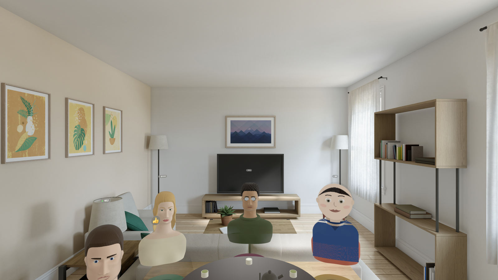 | 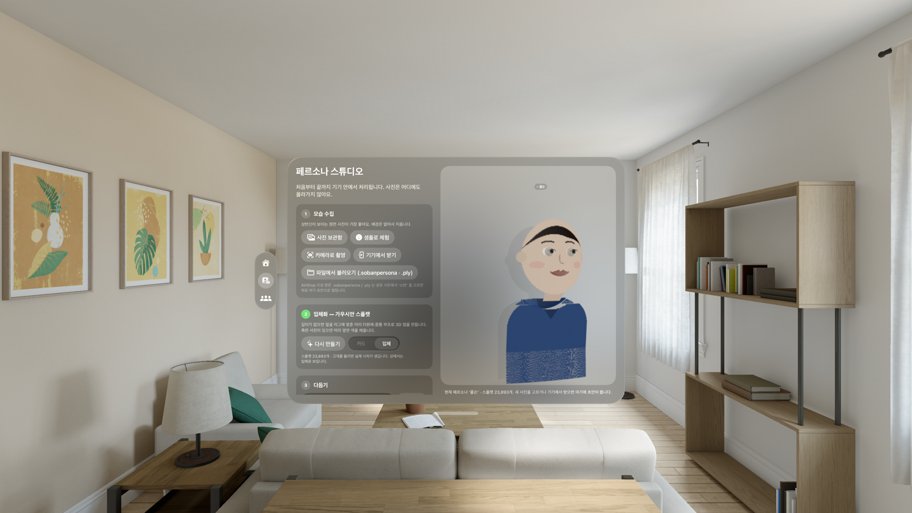 |

| 스튜디오 — PLY 파일 불러오기 (라운드트립) |
|---|
|  |

| 소반 캡처 (Mac, 실제 카메라) |
|---|
|  |

이 절의 visionOS 화면은 visionOS 27 시뮬레이터에서 `sample demo guests=4` 플래그로 캡처했습니다(시뮬레이터에는 손 추적·마이크가 없어 데모 손님이 대신 움직입니다). 소반 캡처 화면은 Mac 의 FaceTime 카메라로 실제 촬영 중인 모습입니다.

## 다이어그램

### 아키텍처 레이어

UI(창·이머시브 공간) → 상태/도메인(`AppModel`·`PersonaStore`·`GatheringSession`·`TableRenderer`) → 엔진(Vision·RealityKit·ARKit·AVFAudio) → 전송(`SessionTransport`) 4계층 구조.


### 페르소나 캡처 파이프라인

사진 한 장이 `GeneratePersonInstanceMaskRequest` → `DetectFaceLandmarksRequest` → 크롭·색 샘플을 거쳐 살아 움직이는 카드가 되는 과정과, `PersonaManifest`/`PersonaAvatar` 레이어 구조.


### 모임 세션 흐름

호스트/손님이 MultipeerConnectivity 풀 메시로 좌석표·페르소나·포즈·음성·반응을 주고받는 순서(시퀀스 다이어그램).


### 두레반 좌석 배치

6석 원탁을 위에서 본 배치(`TableLayout`, 1 m = 160 px)와 옆에서 본 높이·카드 피벗 기준.


### 라이브 포즈 루프

`GatheringSession.tick()` 30Hz 루프에서 머리/손/마이크 신호가 `PersonaPose` 로 묶여 네트워크를 거쳐 `PersonaAvatar.update` 까지 가는 경로, 데모 손님(`BotBrain`)의 자체 루프.


### 모습 수집 분기 (Vision Pro / iPhone·iPad / Mac)

`CaptureAvailability.detect()` 가 플랫폼별로 Vision Pro(카메라 접근 불가) · iPhone/iPad(TrueDepth·LiDAR 깊이) · Mac(일반 카메라)으로 갈라지는 경로와 각도 안내·전송 흐름.


### 가우시안 스플랫 파이프라인 · 입 신호 우선순위

`SplatBuilder` 가 깊이/부조로 3D 점을 만들고 측면 사진으로 색을 채워 `SplatMesh` 로 렌더링하는 과정, 그리고 플랫폼별 입 모양 신호 우선순위(얼굴 추적 → 입술 랜드마크 → 마이크).


## 어떻게 동작하나

```
사진 ─▶ GeneratePersonInstanceMaskRequest ─▶ DetectFaceLandmarksRequest ─▶ 크롭·색 샘플 ─▶ manifest.json + body.png
Vision Pro 머리(WorldTrackingProvider) · 손(HandTrackingProvider) · 마이크 RMS ─▶ PersonaPose ─▶ 15Hz 브로드캐스트
PersonaPose ─▶ PersonaAvatar(RealityKit 레이어: 카드·입·눈꺼풀·손·글로우) ─▶ 두레반 슬롯에 빌보딩
```

자세한 설계와 제약(카메라 접근 불가, 개인 팀의 SharePlay 제약, visionOS 27 의 MultipeerConnectivity deprecated 등)은 [Docs/TechPRD.md](Docs/TechPRD.md), 작업 목록은 [Docs/Tasks.md](Docs/Tasks.md) 를 보세요.

## 요구 사항

- Xcode 27, visionOS 27 SDK (iOS/macOS 배포 타깃 26.0)
- Apple Vision Pro (visionOS 27) — 머리/손 추적, 마이크, 로컬 네트워크는 실기기에서만 동작
- 소반 캡처: iPhone/iPad(iOS 26+, 깊이 카메라 권장) 또는 Mac(macOS 26+)
- 다중 사용자 테스트는 같은 Wi‑Fi 의 Vision Pro 2대 이상

## 빌드와 실행

1. `Soban.xcodeproj` 를 열고 스킴 `Soban`(표시 이름 소반)을 선택합니다.
2. 서명 팀을 본인 팀으로 바꿉니다. 특별한 엔타이틀먼트는 필요 없습니다.
3. Vision Pro 를 선택하고 Run. 첫 실행에서 마이크·손 추적·로컬 네트워크 권한을 허용합니다.
4. (선택) 같은 타깃을 iPhone/iPad/Mac 에 Run 하면 "소반 캡처" 가 뜹니다. Vision Pro 의 페르소나 탭 → **기기에서 받기** 를 켠 뒤, 캡처 기기에서 촬영 → 페르소나 만들기 → Vision Pro 이름 선택 → 보내기.

시뮬레이터 자동 실행(DEBUG 전용 인자):

```bash
xcodebuild -project Soban.xcodeproj -scheme Soban \
  -destination 'platform=visionOS Simulator,name=Apple Vision Pro' build
xcrun simctl launch booted com.coulson.Soban sample splats demo guests=4 distance=1.3
# 인자: sample(만화 샘플) · bust(블렌더 흉상 샘플) · splats · demo · guests=N · tab=home|studio|gathering
#       distance=M · hidewindow · quadsplats(네이티브 대신 쿼드) · exportply=<경로> · import=<경로>
# 환경변수: SOBAN_SIM_AUDIO=1(시뮬레이터 오디오) · SOBAN_DUMP_KIT=1(키트 계층·셰이프키 덤프)
```

| 인자 | 뜻 |
|---|---|
| `sample` | 저장된 페르소나가 없으면 샘플 페르소나 생성 |
| `demo` | 시작 즉시 이머시브 공간 + 데모 손님 |
| `guests=N` | 데모 손님 수 (최대 4 — 블렌더 흉상 4종) |
| `tab=home\|studio\|gathering` | 시작 탭 |
| `hidewindow` | 이머시브가 열리면 창 닫기(스크린샷용) |
| `distance=1.6` | 테이블 거리(m) |
| `splats` | 샘플 페르소나와 데모 손님을 가우시안 스플랫 입체로 |
| `exportply=/path.ply` | 활성 페르소나 스플랫을 3DGS PLY 로 기록 |
| `import=/path` | `.sobanpersona` / `.ply` 를 불러와 초안으로 (파서 검증용) |

시뮬레이터에서는 오디오 엔진이 기본으로 꺼집니다(AURemoteIO 초기화 타임아웃 회피). 켜려면 환경 변수 `SOBAN_SIM_AUDIO=1`.

## 프로젝트 구조

```
MyApp/
  MyApp.swift (visionOS: SobanApp / 그 외: SobanCompanionApp) · ContentView.swift
  App/        AppModel · LaunchOptions · HomeView · StudioView · GatheringView · PersonaPreviewView   [visionOS]
  Persona/    PersonaModels · PersonaBuilder(+DepthRefiner) · PersonaStore · PlaceholderPersona        [공용]
              SplatCloud · SplatBuilder · SplatMesh · PersonaAvatar · BustAvatars(TableAvatar)         [공용]
  FaceRig/    FaceRig(FaceRigComponent·FaceRigSystem·HangulViseme) · SobanFaceAssets(USDZ 로더)          [공용]
  FaceAssets/ DemoAvatar_{Ethan,Olivia,Lucas,Emma}.usdz · SplatFace_{Eyes,Mouth}_{Male,Female}.usdz · SplatPlaceholder_Bust.usdz
  Sensing/    MouthSource(MicLevelMeter)                                                                [공용]
              FaceMouthTracker                                                                          [iOS]
              HeadHandTracker · VoiceEngine                                                             [visionOS]
  Room/       TableLayout(공용) · TableScene · TableRenderer · TableImmersiveView                        [visionOS]
  Session/    SessionMessages · MultipeerTransport(SessionTransport/PeerHandle) · DemoGuests            [공용]
              GatheringSession · BotSpeech(TTS)                                                         [visionOS]
  Capture/    CaptureAvailability · CaptureGuide · PersonaTransfer(Receiver 공용 / Sender iOS·macOS)
              CameraCaptureController                                                                   [iOS·macOS]
  Companion/  CompanionRootView                                                                         [iOS·macOS]
Docs/         TechPRD.md · Tasks.md · diagrams/*.svg · screenshots/*.png · blender/Soban_FaceAssets.blend
```

## 실기기 피드백 반영 (2026-10-02 2차)

| 보고된 문제 | 조치 |
|---|---|
| 스튜디오 미리보기 볼륨이 사진 보관함 시트를 가림 | 3D 콘텐츠를 유리면 뒤 5cm 로 옮기고, 피커/시트가 떠 있는 동안 숨김 |
| 마이크 레벨미터는 움직이는데 입이 안 움직임 | `.task` 가 시작 시점 값만 캡처하던 버그 → 매 프레임 호출되는 `levelSource` 클로저로 교체 |
| 이름을 바꿔도 미리보기 이름표에 반영할 버튼이 없음 | 입력 즉시 이름표 반영 + **이름 적용** 버튼(초안/현재 페르소나 저장) |
| 데모 손님 목소리가 없음 | `AVSpeechSynthesizer.write` 한국어 TTS → 좌석 위치 공간 재생 + 엔벨로프 입 동기화, 자리 카드에 자막 |
| 대화 중 내 모습을 3인칭으로 볼 수 없음 | **내 모습 보기(거울)** 토글 — 내 자리 오른쪽 위에 좌우 반전된 내 아바타 |
| Vision Pro 를 벗고 촬영하는 기능 | visionOS 는 카메라 접근 불가 → 런타임 판별 후 안내, iPhone/iPad(깊이)·Mac(일반) **소반 캡처** 분기 + 전송 |
| 상 접기 후 다시 펼쳐지지 않음 | ARKit 세션/프로바이더는 stop 후 재사용 불가 → 매번 재생성, 이머시브 상태를 뷰 생명주기로 동기화, 실패 사유 표시 |

## 3차 개선 (2026-10-02)

| 요청 | 조치 |
|---|---|
| 컴패니언에서 다각도 촬영 → 가우시안 스플랫 → Vision Pro 로 전송/감상 | `SplatBuilder`(깊이/부조 초기화 + 측면 융합), `SplatMesh`(RealityKit 쿼드 아틀라스), 입체 미리보기 턴테이블, 3DGS PLY 내보내기, 스플랫 포함/사진만 전송 |
| Vision Pro 가 스플랫을 받거나 사진만 받아 직접 만들어 초안으로, 저장 즉시 사용 | `PersonaReceiver` 가 리소스 묶음을 조립 → 스튜디오 **초안**(스플랫 없으면 Vision Pro 가 생성) → '내 페르소나로 저장 (바로 사용)' |
| 입 모양: 레벨미터, 내부 센서 가능하면 사용·불가하면 마이크, 컴패니언에도 포함 | `VoiceLevelBar`(피크 홀드) + 권한 상태/허용 버튼, visionOS 는 센서 불가 안내 후 마이크, iPhone/iPad TrueDepth `jawOpen`, Mac 입술 랜드마크, 마이크 폴백 |

## 4차 수정 (2026-10-02)

| 보고 | 조치 |
|---|---|
| Vision Pro 에 PLY 를 받아도 불러올 버튼이 없음 | `fileImporter` **파일에서 불러오기**, `.sobanpersona`/PLY 문서 타입 등록 + `onOpenURL`(AirDrop → '소반' 으로 열기), PLY 파서 → 카드 렌더 → 얼굴 리그 재검출, 위아래 뒤집기, 컴패니언에 `.sobanpersona` 공유 추가 |
| 마이크 토글 후 레벨미터 무반응, '마이크 허용 요청' 무기능, "사용 가능한 마이크 입력이 없습니다" | 출력 전용으로 먼저 시작된 `AVAudioEngine` 에서 나중에 `inputNode` 를 만지면 포맷이 0 이 되는 문제 → 엔진 시작 **전에** 입력 노드 구성, 필요 시 재시작. 버튼은 실제 권한 요청 → 입력 포함 재시작 → 탭 설치. 입력 포맷/라우트 진단 문구 표시 |

## 5차 — 블렌더 에셋 교체 (2026-10-02)

| 교체 대상 | 전 | 후 |
|---|---|---|
| 데모 손님 | CoreGraphics 로 그린 2D 만화 카드 5명 | Blender MCP USDZ 흉상 4명(`DemoAvatar_*`), `FaceRigComponent/System` 블렌드셰이프로 깜빡임·시선·TTS 자막 한글 비셈 립싱크 |
| 스플랫 페르소나의 입·눈꺼풀 | 2D 타원 스프라이트 | `SplatFace_Eyes/Mouth_{Male,Female}.usdz` — 에셋 안의 실제 눈알·입 중심을 읽어 리그 위치·눈 간격에 맞춰 배치, 피부색 틴트, 남/여/끄기 선택 |
| 페르소나 미도착 자리 | 아무것도 없음 | `SplatPlaceholder_Bust.usdz` 반투명 흉상 |

`TableAvatar` 프로토콜로 `PersonaAvatar`(카드/스플랫+키트)·`DemoBustAvatar`·`PlaceholderBustAvatar` 를 한 렌더러가 다룹니다. 블렌더 원본은 `Docs/blender/Soban_FaceAssets.blend`.

## 6차 — 키트 일체감 · 흉상 템플릿 입체화 · 컴패니언 미리보기 (2026-10-02)

실기기에서 USDZ 눈알·입술이 얼굴 앞으로 튀어나오고, iPhone 미리보기의 페르소나가 너무 작다는 피드백을 반영했습니다.

| 항목 | 전 | 후 |
|---|---|---|
| 눈 키트 | 흰자·홍채·동공까지 사진 위에 떠서 "눈이 두 쌍" | 눈알 모델은 **숨기고 눈꺼풀만** 남김 — 사진의 눈이 그대로 보이고 깜빡일 때만 피부색 눈꺼풀이 덮임. 가로는 눈 간격, 세로는 눈 높이에 맞춰 스케일, 앞뒤는 0.45 로 눌러 눈꺼풀 앞면이 표면 +1.5 mm |
| 입 키트 | 입술이 입 앞으로 돌출 | 입술 폭을 리그 입 폭에 맞추고 앞뒤 0.35 로 눌러 표면에 밀착, 입술색 머티리얼(색으로 식별)을 리그 `lip` 색으로 틴트. 치아·입 안은 `JawOpen` 때만 보임 |
| 적용 범위 | 스플랫 입체일 때만 | **카드(샘플로 체험)에도** 부착 — 샘플 캐릭터도 눈꺼풀 깜빡임·입술 비셈 동작 |
| 입체화 깊이 | 머리 타원체 + 몸통 반원기둥 수식 | `SplatPlaceholder_Bust.usdz` 를 **투명 목(mock) 깊이 템플릿**으로 래스터화(`BustTemplate`), 눈 간격·눈 중심으로 흉상 공간에 맞춰 머리·목·**어깨 굴곡**을 읽음. 실루엣 밖(넓은 어깨·머리끝)은 평활된 가장자리에서 뒤로 기울임 |
| 얼굴 범위 인식 | 눈·입·코 사각형 | 온디바이스 Vision 76점 랜드마크에서 **눈썹·얼굴 윤곽·머리카락색**까지 리그에 저장(`FaceRig.leftBrow/rightBrow/contour/hair`) |
| 머리카락 | 평평 | 눈썹 윗선·윤곽 폭·피부/머리카락색으로 분류 → **볼륨 돔 + 흩뿌린 2겹 셸**(명도 변화·앞으로 띄움) |
| 옆면 줄무늬 | 격자 샘플이 z 로 늘어나 틈 | 법선 기울기로 스플랫 크기 보정(최대 3.2배) |
| 컴패니언 미리보기 | 기본 카메라가 멀어 엔티티가 작고 여백이 큼 | iPhone/iPad/Mac 에 전용 `PerspectiveCamera`(FOV 36°) 를 두어 카드가 세로의 ~90% 를 채움. 키트·템플릿·머리카락 파이프라인은 Vision Pro 와 **같은 코드** |

| 스튜디오 — 샘플 입체 + 눈꺼풀만 남긴 키트 | 턴테이블 연속 캡처(3행 2열에 깜빡임 프레임) |
|---|---|
| 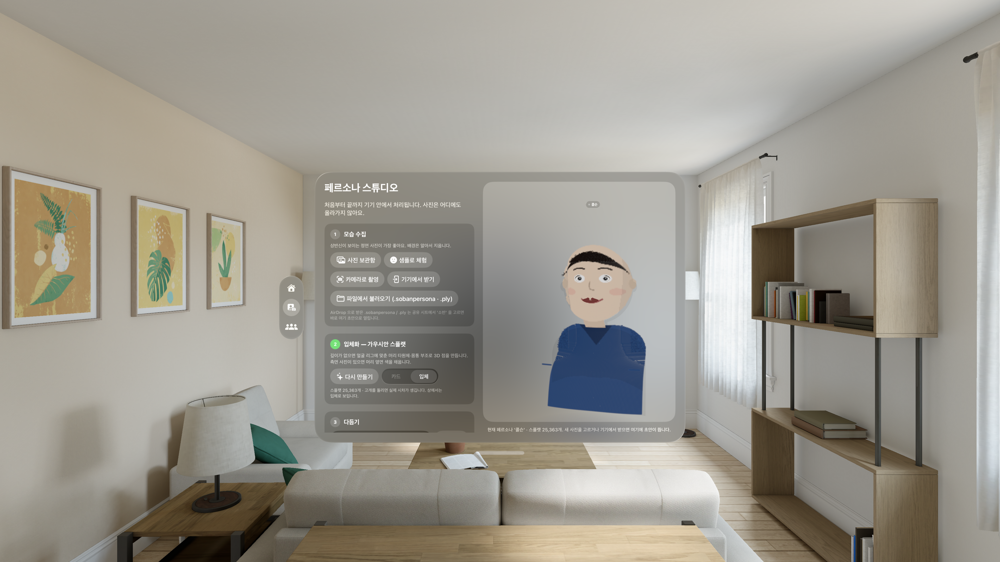 | 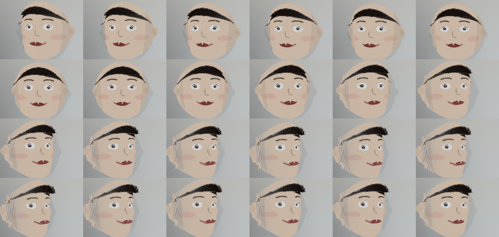 |

| 소반 캡처(Mac) — 프레임을 채우는 미리보기 | 두레반 — 흉상 손님 + 거울(6차 키트) |
|---|---|
| 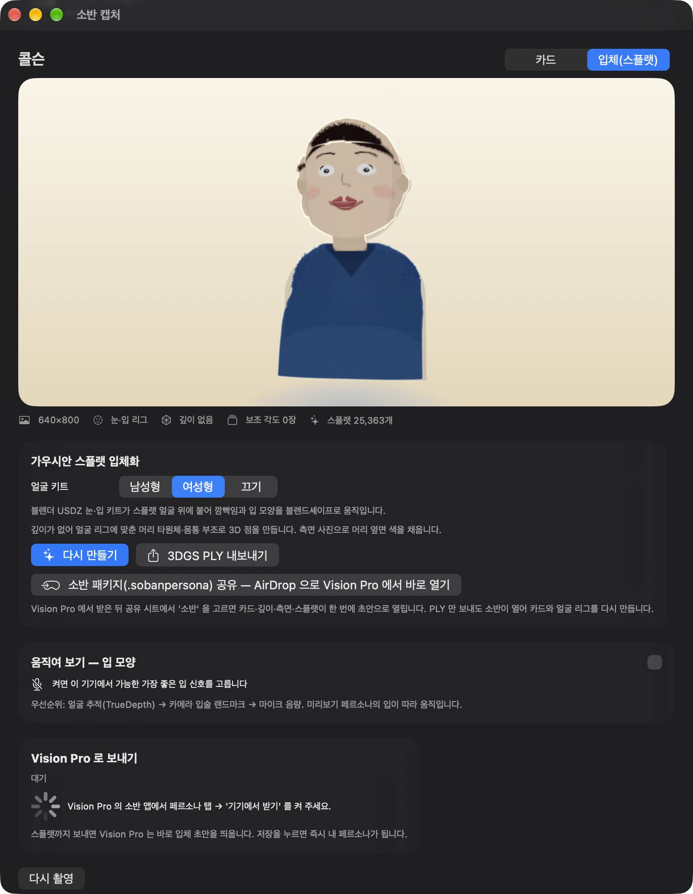 | 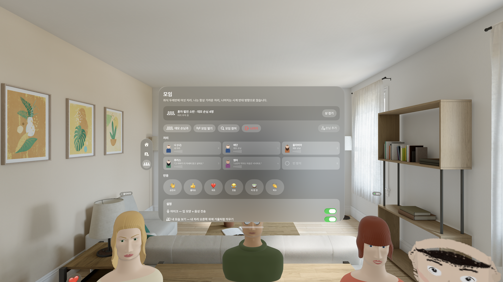 |

> VLM(FoundationModels 등) 대신 Vision 랜드마크를 쓴 이유: 언어 모델은 픽셀 단위 좌표를 안정적으로 내지 못하고, Vision 은 같은 온디바이스 ML 로 76점 좌표를 밀리초에 돌려줍니다. 둘 다 사진은 기기를 떠나지 않습니다.

## 7차 — 템플릿을 사진에 맞춰 변형 · 외형 힌트 · 흉상 샘플 · 상태 유지 (2026-10-02)

6차까지는 흉상 템플릿의 깊이를 사진 위에 "얹기만" 해서 눈코입 위치는 맞아도 얼굴 윤곽은 템플릿 모양 그대로였습니다. 7차는 **템플릿을 사진 쪽으로 휘는** 단계를 넣었습니다. 사진 픽셀은 늘이거나 줄이지 않습니다.

| 항목 | 구현 |
|---|---|
| 얼굴 윤곽 맞춤 | Vision 76점 랜드마크(눈·눈썹·코끝·입 중심/양끝·얼굴 윤곽 12점) ↔ 흉상 대응점(눈 ±0.032/0.44, 코끝·턱은 템플릿에서 측정, 윤곽은 같은 높이 비율의 실루엣 가장자리)을 **박판 스플라인(TPS)** 으로 연결. 사진 좌표 → 흉상 좌표 사상 `TemplateFit.map` 으로 깊이를 읽으므로 템플릿이 사진 얼굴 모양대로 휜다 |
| 목·어깨·머리카락 | 인물 마스크의 **행별 실루엣 폭**을 흉상 같은 높이의 실루엣 폭에 맞춰 가로를 늘이고 줄임(0.6–1.6배). 얼굴 타원 가장자리에서 TPS 와 smoothstep 블렌딩 |
| 외형 힌트 (보조) | `FoundationModels` 에 사진을 첨부해 `@Generable` 구조체(머리 길이·볼륨·앞머리·안경·어깨 노출)로 받음. **머리카락 범위·볼륨 초기값에만** 사용, 좌표는 Vision 만 신뢰. Apple Intelligence 를 못 쓰면(시뮬레이터·OS 26) 리그/색 휴리스틱. Mac 실측: 만화 샘플에 "짧은 머리 · 볼륨 작음 · 앞머리" |
| 키트 재정렬 | 부조 그리드를 96×128 로 올려 눈꺼풀·입술 키트가 변형된 표면 z 에 앉음. Vision Pro / iPhone / iPad / Mac 모두 같은 `SplatBuilder.build(from:template:hints:)` |
| 샘플로 체험 | 블렌더 USDZ 데모 흉상 4종 중 **랜덤**(에단·올리비아·루카스·엠마). 매니페스트 `demoAvatar` 에 저장되어 스튜디오 미리보기·거울·상·원격 참가자 모두 같은 흉상. 이미 입체라 스플랫 단계는 건너뜀 |
| 상태 유지 | 스튜디오 상태를 `AppModel` 이 소유하고, 컴패니언은 `CompanionModel` 을 앱이 소유. **Combine** `PassthroughSubject` + `debounce` 로 설정(0.4 s → UserDefaults)·초안/페르소나 패키지(1.5 s → Documents `.sobanpersona`)를 저장, 재실행 시 복원("이전 초안을 복원했어요") |

| 스튜디오 — 랜덤 블렌더 흉상 샘플 | 두레반 — 흉상 샘플이 거울(오른쪽 아래 '콜슨 · 거울')과 자리에 |
|---|---|
| 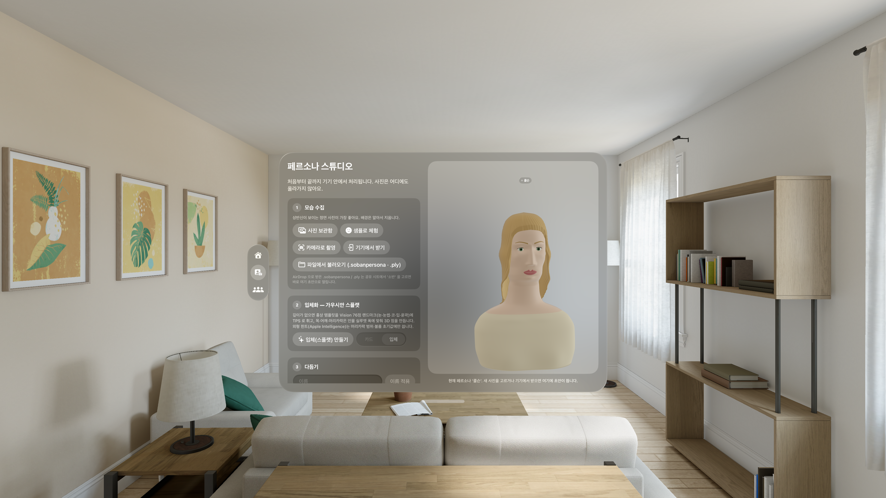 | 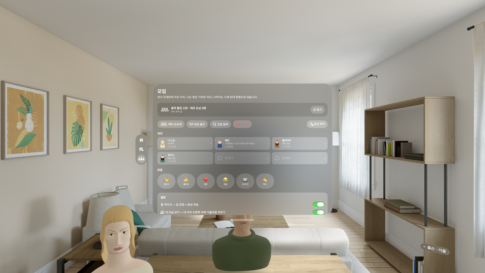 |

| 소반 캡처(Mac) — 재실행 후 복원, Apple Intelligence 외형 힌트 | 스튜디오 — TPS 변형 템플릿 입체 턴테이블 |
|---|---|
| 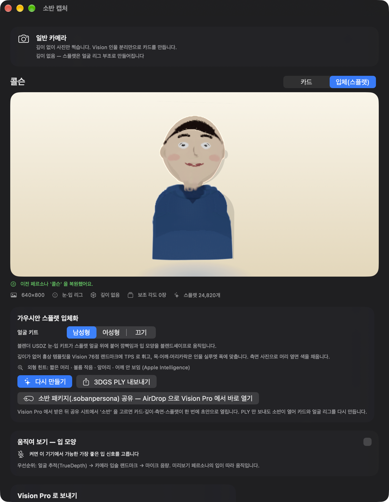 | 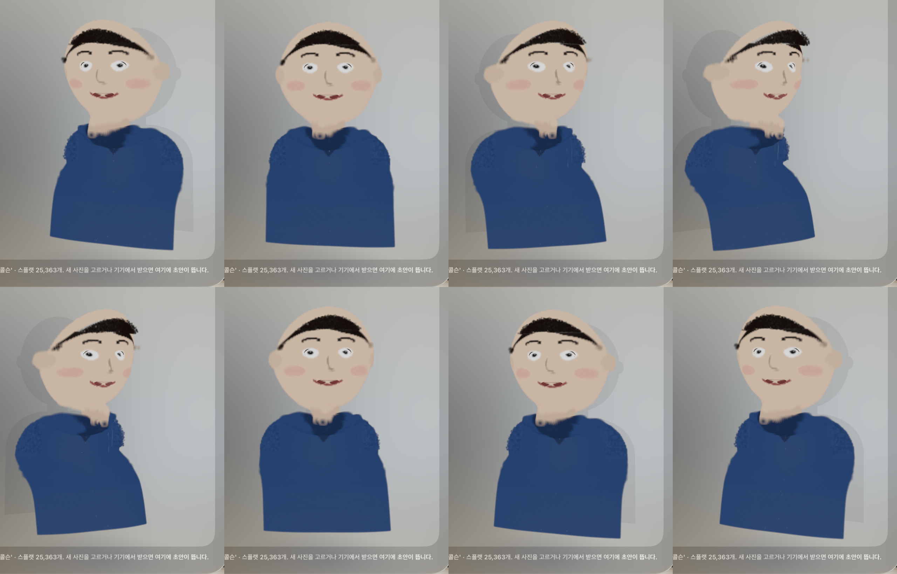 |

## 8차 — ARKit 52 표준 · RealityKit 27 네이티브 스플랫 · 표정 신호 직결 (2026-10-02)

조사 문서("비전프로 Persona처럼 직접 만드는 커스텀 아바타")의 **단기 로드맵(전부 로컬)** 을 구현했습니다. 블렌더 USDZ 9종은 그대로 필수로 씁니다.

| 항목 | 구현 |
|---|---|
| 내부 표준 ARKit 52 | `ArkitBlendShapes.swift`: 52개 이름(`ArkitShape`), 가중치 값 타입(`ArkitWeights`), 비셈(A/I/U/E/O/Press) → ARKit 조합 프리셋. `FaceRigSystem` 은 매 프레임 ARKit 공간 목표를 만들고 `ShapeNameAdapter` 가 메시가 가진 이름(현재 레거시 13개 / 앞으로 ARKit 52)으로 바꿔 넣음 → 블렌더에서 ARKit 이름으로 다시 내보내면 코드 수정 없이 직통 |
| 외부 표정 신호 | `FaceRigComponent.externalWeights`: iPhone TrueDepth 는 ARKit 52 **전체**(깜빡임 포함), Mac/iPhone 카메라는 Vision 랜드마크에서 추정한 미니 세트(턱·깜빡임·미소·오므림·눈썹). 소반 캡처 미리보기의 키트·흉상이 내 표정을 그대로 따라함 |
| 립싱크 규칙 | RMS 는 턱 **에너지 엔벨로프**로만, 모양은 비셈이 결정. 초성 ㅁ/ㅂ/ㅍ/ㅃ → 70 ms 입술 폐쇄, 받침 ㅁ/ㅂ/ㅍ 폐쇄 유지, 비셈 전환 50 ms 크로스페이드(코아티큘레이션), 다음 비셈 40 ms 선행 |
| 네이티브 스플랫 | OS 27 기기(visionOS·iOS·macOS)에서 `GaussianSplatComponent` + `LowLevelBuffer`(스플랫당 pos·scale·rot·opacity·SH0 14 float 인터리브). 정렬·타원체 투영은 RealityKit. 버퍼를 참조하므로 **`SplatJawDeformer` 가 jawOpen 에 따라 윗입술 아래~턱 스플랫을 턱관절 축으로 회전**해 메시 키트와 같은 신호로 움직임. 시뮬레이터 SDK 에는 이 API 가 없어 쿼드 아틀라스로 폴백(`quadsplats` 인자로 강제 가능) |
| 구멍 뚫기 | 얼굴 키트를 쓰면 입술 안쪽 스플랫을 제거(페더링)해 턱을 벌릴 때 치아·입 안 메시가 보임 |
| 블렌더 요청 | `Docs/blender/ARKit52-요청.md`: 이름 변환 표, 최소 세트, 분할 방법, 내보내기 주의(Blender 4.1+, Apply Modifiers 끔) |

보류한 항목과 이유: MediaPipe(외부 SPM/CocoaPods 의존, 오프라인 검증 불가 → Vision 랜드마크 미니 세트로 대체), LAM/Audio2Face(CUDA 서버 필요), SpeechAnalyzer 단어 타이밍(visionOS 가용성 미확인, 다음 차수), SharePlay 가중치 스트림(Vision Pro 에는 표정 소스가 없어 지금은 의미 없음).

**2026-10-03 ARKit 52 에셋 교체 완료**: 블렌더(MCP, Blender 5.2)에서 `Soban_FaceAssets_ARKit52.blend` 로 재내보낸 USDZ 8개를 `Soban/FaceAssets/` 에 교체했습니다. 입 16·눈꺼풀 14·눈썹 5·Head jawOpen, Left = +X, 레거시 키 삭제. 앱은 셰이프키 이름을 보고 자동으로 **"ARKit 52 직통"** 경로를 탑니다(스튜디오 4단계·소반 캡처에 표시). 블렌더 쪽 재합성 오차 보고에 따라 비셈 프리셋을 보정했습니다(A 에 mouthUpperUpL/R 0.3 추가, E 의 jawOpen 0.3 → 0.4). 시선 미세 움직임은 이제 눈알 회전과 함께 `eyeLookIn/Out/Up/Down` 으로도 눈꺼풀에 전달됩니다.

| 소반 캡처(Mac) — RealityKit 27 네이티브 스플랫 턴테이블 (큰 yaw 에서도 줄무늬 없음) | 두레반 — ARKit 어댑터로 구동되는 흉상 립싱크 프레임 |
|---|---|
| 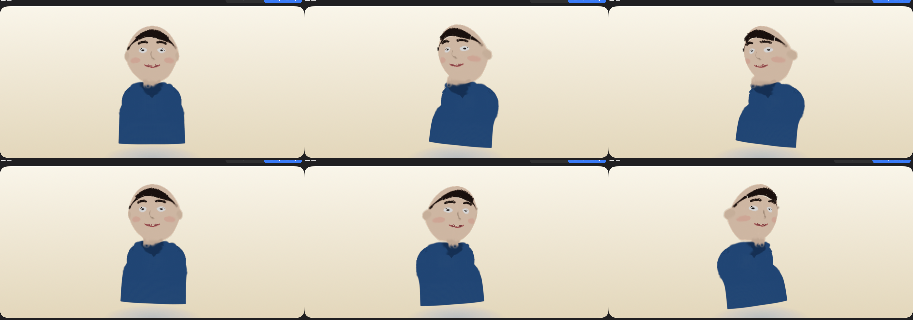 | 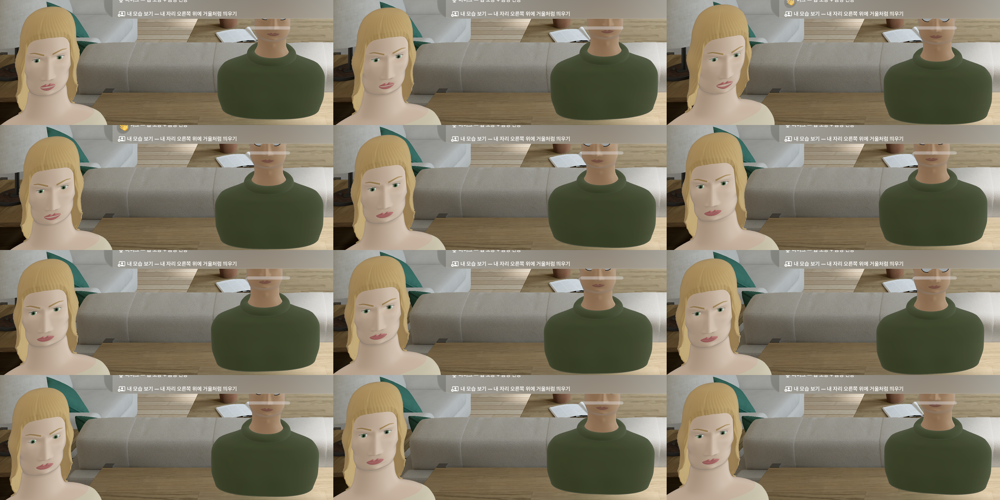 |

| 두레반 — ARKit 52 에셋 직통 립싱크 | 스튜디오 — ARKit 52 눈꺼풀 키트 연속 캡처 |
|---|---|
| 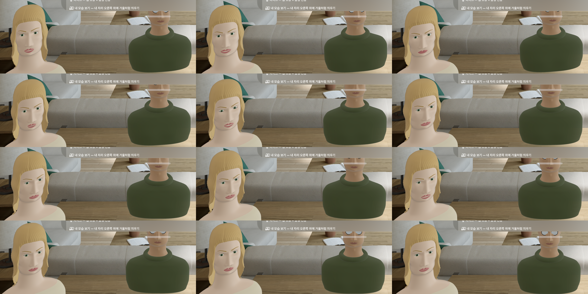 | 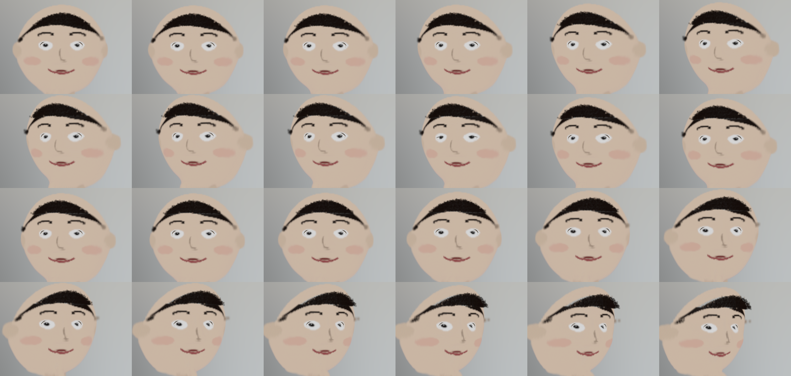 |

## 로드맵

- 스플랫 미분 최적화(학습) — 현재는 초기화만 (Metal 컴퓨트 기반 소규모 최적화 검토)
- Network.framework 전송 계층(TN3213)으로 MultipeerConnectivity 교체
- 음소 기반 입 모양, 사진 입체화(Spatial3DImage), 교자상 변형
- 같은 방에서 `SharedCoordinateSpaceProvider` 로 한 테이블 공유
- 유료 팀 전환 시 GroupActivities(FaceTime) 어댑터

## 라이선스

[Apache License 2.0](LICENSE). Apple 프레임워크는 Apple SDK 라이선스를 따릅니다([NOTICE](NOTICE)).

---

### English summary

**Soban** (소반, "small low table") is a visionOS 27 app for Apple Vision Pro. Pick one photo of yourself; Vision separates the person from the background and finds eye/mouth landmarks to build a transparent 2.5D "paper doll" persona. The persona comes alive from the headset's device anchor (head yaw/pitch/roll), hand-tracking wrists, and microphone level (mouth opening), plus blinking and breathing. Up to six people sit around a Korean floor table in a mixed immersive space; peers on the same Wi‑Fi connect through a full-mesh MultipeerConnectivity session (SharePlay is unavailable to personal developer teams), exchange persona packages, stream 15 Hz pose packets and 60 ms voice chunks that are spatialized at each seat, and send emoji reactions. Demo guests speak with Korean TTS and lip-sync to it; a mirror toggle shows your own persona in third person. Because visionOS gives third-party apps no camera access, the same target also builds as **Soban Capture** for iPhone/iPad (TrueDepth/LiDAR depth) and Mac (plain camera): guided front/side/up captures, depth-refined cutout, and transfer to the Vision Pro over the local network or AirDrop. Captures are turned into **Gaussian splats** (depth- or face-rig-relief-initialized, side views color the head's sides, no differentiable training), rendered with a RealityKit quad atlas on every platform, exportable as standard 3DGS PLY, and received on Vision Pro as a draft that becomes the active persona on save. Mouth motion falls back from TrueDepth face tracking (iPhone/iPad) → camera lip landmarks (Mac) → microphone level (Vision Pro has no inward camera access). Licensed under Apache-2.0.
